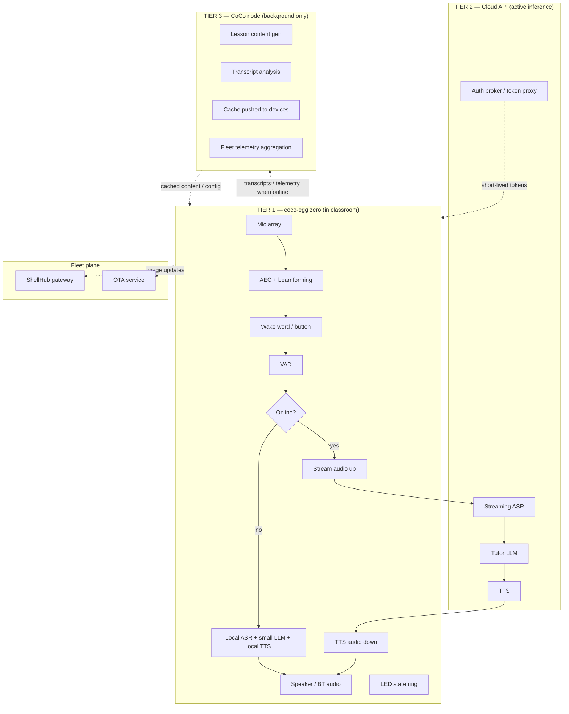

# coco-egg zero — Engineering Scope & Design Spec

**Status:** v0.2 Draft — for engineering review (revised: **offline-first build order** — local mode is the v0 product, cloud is Phase 2 enablement)
**Owner:** Naveen
**Program:** CoCo (CommonCompute)
**Goal of this doc:** define the first buildable coco-egg zero unit — a voice-based edge tutor device — clearly enough for the team to cost it, order parts, and start bring-up.

Tags used throughout: **[FIXED]** = decided, don't relitigate · **[REC]** = recommended default, confirm · **[OPEN]** = needs a decision, owner assigned in §15.

---

## 1. Purpose & Scope

coco-egg zero is a standalone voice device that lets a learner talk to an AI tutor and get spoken answers back, deployed in classrooms — including remote classrooms with unreliable connectivity. It is the first hardware endpoint in the CoCo ecosystem.

**v0 definition of success:** a learner presses/speaks to a physical egg in a classroom, asks a question aloud, and hears a useful spoken tutor response — **fully locally, with no network dependency** — with the unit visible and remotely manageable from a central console. Cloud inference is a later enablement that upgrades quality when connectivity allows; it is not required for the device to be useful.

**Build order [FIXED]: local/degraded mode first, cloud enablement second.** The local voice loop *is* the v0 product. This inverts the usual voice-assistant architecture deliberately: it matches the remote-classroom reality (offline is normal), and it forces us to make the local experience genuinely good instead of treating it as an afterthought fallback.

**In scope for v0**
- Single working device: onboard mic + speaker, wake-word or button trigger, full voice loop.
- Cloud-backed active tutoring (ASR → LLM → TTS).
- Offline-degraded tutoring mode.
- Bluetooth audio as a fallback I/O path.
- Fleet enrolment + remote access via ShellHub.
- A basic OTA/update path.
- An enclosure that looks like a product, not a breadboard.

**Out of scope for v0** (park these, note them so nobody silently assumes them)
- Screen / camera / vision.
- Multi-language beyond the one launch language.
- Payments, token/credit economy integration (that's the CoCo compute-node track, not this device).
- On-device model training.
- Battery operation (v0 is mains-powered; battery is a later SKU).

---

## 2. Fixed Constraints & Design Principles

1. **[FIXED] Fleet management is ShellHub.** All fleet access/observability is built around the ShellHub agent + namespaces model.
2. **[FIXED] Primary audio is onboard mic + speaker; Bluetooth audio is the fallback path.** (This is an *audio I/O* fallback — distinct from network fallback, see §4.)
3. **[FIXED] Inference tiering (revised for offline-first):**
   - On-device → the **primary tutor loop**: local ASR + small local LLM + local TTS, scoped to specific tutor use cases (not open-ended chat).
   - Cloud API → **quality upgrade when online** — enabled in a later phase, never a dependency.
   - CoCo node (Chiang Mai/Goa) → **background/async only**: content generation, transcript analysis, and — its clearest job — **fine-tuning the on-device model**, which then ships to the fleet via OTA. The node is the model factory; the egg is the delivery vehicle.
4. **Remote-classroom reality is the design centre.** Intermittent or absent connectivity is assumed normal. Offline resilience is a core requirement, not a nice-to-have. This single assumption drives the board choice, the local software stack, and the sync design.
5. **The device is dumb about secrets.** No raw cloud API keys ever live on a field device (see §12).

---

## 3. System Architecture

Three tiers, deliberately decoupled so a failure or slow link in one never blocks the tier above it.

**Why this split:** remote classrooms cannot be assumed to have a reliable real-time link to anything — not the Chiang Mai node, and often not the cloud either. So nothing a learner waits on leaves the device in v0. When cloud enablement lands (Phase 2), it's a quality upgrade on a working product, geographically neutral and always-on where the node is not. The CoCo node earns its keep on the async side — content generation overnight, analysing sessions, and above all fine-tuning the on-device model that ships back down via OTA. Nothing a learner waits on ever runs on the node.

---

## 4. Connectivity & Resilience

This is the section that remote classrooms make load-bearing.

**Network path (separate from Bluetooth audio):**
- **[REC]** WiFi primary.
- **[OPEN]** Cellular (LTE) fallback for classrooms with no WiFi — USB LTE dongle or an onboard modem module. Needs a connectivity survey of target classrooms before we decide whether this is v0 or v1.
- Ethernet where available (trivial to support, near-free).

**Device state machine (local is the base state, not the fallback):**
- `LOCAL` — the default and v0-complete mode: local ASR → small local LLM → local TTS. Works with zero connectivity. Session transcripts buffered on disk.
- `SYNC` — opportunistic, whenever a link appears: flush buffered transcripts/telemetry up to the CoCo node; pull new cached content, config, and **model updates**.
- `CLOUD-ENHANCED` — Phase 2 (post-cloud-enablement): when online with good latency, route the LLM (and optionally ASR/TTS) to cloud for higher quality, with hard timeouts and instant fallback to `LOCAL` on any miss.

**Design rules**
- The device must be fully useful with the network cable cut on day one. Cloud only ever *adds* quality.
- Every cloud call (Phase 2) has a timeout and a local fallback; the loop never hard-blocks on the network.
- Buffer-and-forward for anything bound for the CoCo node.

**Local quality bar (replaces the old "how good must offline be" question):** the local model is **scoped, not general** — it targets defined tutor use cases (curriculum Q&A, drills, guided lesson flows for the launch subject/grade band) and is allowed to say "I don't know that yet" outside them. **[OPEN]** define the exact launch use-case list and grade band — this is now the single most important product decision, since it sets the model, prompt/RAG content, and eval set.

---

## 5. Audio Subsystem

The hardest engineering risk on this device is echo/barge-in: it speaks and listens in the same small room. Solve it in hardware if we can.

**Mic array — [FIXED for M1] Seeed ReSpeaker XVF3800 4-mic array (bare board, ~$40).** XMOS XVF3800 with hardware AEC, AGC, beamforming, DoA, dereverberation, and noise suppression on-chip; 360° far-field pickup to 5m; USB and I2S modes. Critically, it has an onboard speaker connector supporting a 5W amplifier speaker plus a 3.5mm jack — **the speaker must be driven through this board**, so the AEC always has its echo reference at silicon level. This also deletes the separate I2S amp from the BOM. Its 3 GPI / 5 GPO pins can host the push-to-talk button and mute/state LEDs.

**Bench bring-up hardware — [FIXED for M0]: eMeet M0 Plus USB speakerphone.** Entire audio subsystem in one USB audio class device: 4-mic 360° array, VoiceIA 4.2 (AEC/NR, full duplex), 3W speaker, ~15ft pickup — and Bluetooth, which lets us exercise the BT audio fallback path against the same unit. Not embeddable, no GPIO — it is strictly the M0 bench part; the XVF3800 replaces it at M1. Latency/eval numbers logged at M0 are tagged "M0 Plus" and re-baselined once on XVF3800 hardware at M1.

**Sourcing:** XVF3800 bare board from Seeed direct (CN warehouse; ship to the Nashik address for the M1 build window, ~1–2 week lead). Contingency if lead time slips: ReSpeaker USB Mic Array v2.0 (XVF-3000, hardware AEC + 3.5mm out) via Lazada TH or robu.in — a legitimate substitute. Do **not** substitute the ReSpeaker 4-Mic Pi HAT (raw mics, no hardware AEC) or raw INMP441 modules — no hardware AEC means software echo cancellation, which is the risk this part selection exists to eliminate.

**Speaker + amp — [FIXED for M1]** generic 4Ω 3–5W full-range driver (2–3", ~₹150–400), wired to the **XVF3800's onboard speaker output** and mounted against the enclosure grille. No separate amp board needed. (M0 uses the M0 Plus's built-in 3W speaker.)

**Trigger — [OPEN]** wake word vs push-to-talk button vs both. A physical button is far more robust in a noisy classroom and simpler for v0; a wake word is nicer UX. Recommend **button for v0, wake word fast-follow** (openWakeWord).

**LED state ring — [REC]** an addressable LED ring (idle / listening / thinking / speaking / offline). Non-negotiable UX for a screenless voice device — the learner needs to know it heard them.

**On-device audio pipeline:**
`capture → AEC → wake word/button → VAD → local ASR → local tutor LLM → local TTS → playback`
(Phase 2 inserts an optional cloud route at the ASR and LLM stages, with timeout + local fallback.)

**Bluetooth audio fallback — [FIXED as concept, OPEN on detail]:** if the onboard speaker/mic is unavailable or a headset is preferred, route audio over Bluetooth. Note the asymmetry: A2DP gives good-quality *output* to a BT speaker; BT *microphone* input (HFP/mSBC) is low quality. **[OPEN]** confirm whether "BT fallback" means (a) output-only to a BT speaker, (b) a full BT headset including mic, or (c) BLE for provisioning/config only. These are three different builds — my read of the ask is (a)+(c), but confirm.

---

## 6. Compute / Hardware BOM

Offline-degraded mode (§4) rules out Pi Zero–class boards — the device must run local ASR + a small LLM + local TTS. That lands the BOM at Pi 5 / CM5 class.

| Component | Recommendation | Tag | Notes |
|---|---|---|---|
| Compute (bring-up) | Raspberry Pi 5, 8GB | [REC] | Best ecosystem; fastest to a working unit. |
| Compute (product SKU) | Raspberry Pi Compute Module 5 (CM5) on carrier | [REC] | Productization target once bring-up validates. |
| AI accel (optional) | Pi AI HAT+ (Hailo-8L 13 TOPS) | [OPEN] | Only if offline model needs it; decide after §4 offline-quality call. |
| Audio (M0 bench) | eMeet M0 Plus USB speakerphone | [FIXED] | 4-mic + VoiceIA 4.2 + 3W spk + BT in one USB device; bench only. |
| Mic array (M1) | Seeed ReSpeaker XVF3800, bare board | [FIXED] | HW AEC/beamforming; drives the speaker; GPIO for button/LED. See §5. |
| Speaker (M1) | 4Ω 3–5W full-range driver, 2–3" | [FIXED] | Wired to XVF3800 speaker out — no separate amp. |
| LED ring | Addressable RGB ring | [REC] | State feedback. |
| Trigger | Physical button (+ wake word later) | [REC] | |
| Connectivity | Onboard WiFi/BT; LTE dongle | [OPEN] | LTE pending classroom survey. |
| Storage | 32GB+ industrial microSD or eMMC (CM5) | [REC] | eMMC strongly preferred for fleet reliability. |
| Power | USB-C 5V/5A (Pi 5 needs 5A) | [FIXED] | Mains only in v0. |
| Enclosure | Egg-form, vented, speaker grille, LED diffuser | [OPEN] | 3D-printed for v0; tooling later. |

**[OPEN]** target BOM cost per unit — set a number (e.g. sub-₹X) so part choices have a ceiling to design against.

---

## 7. On-Device Software Stack

- **OS — [REC]** Raspberry Pi OS Lite (64-bit) for v0 speed; migrate to a Yocto/Buildroot image for the product SKU when we want reproducible, minimal, A/B-updatable images.
- **App packaging — [REC]** the coco-egg app runs as a **Docker container** (mirrors ShellHub's own agent model and makes updates a clean image pull). See §10.
- **Components (all local-first — this stack IS the v0 product):**
  - Wake word: openWakeWord · VAD: Silero VAD
  - ASR: whisper.cpp (base/small — benchmark both on target board for latency vs accuracy)
  - TTS: Piper — local, low latency, decent voices. Stays the default even after cloud enablement; cloud TTS only if voice quality demands it.
  - **Tutor LLM — [FIXED 2026-07-21]: Qwen3-1.7B (Q4_K_M) served by llama-server (llama.cpp), thinking mode disabled.** Rationale: on a memory-bandwidth-bound Pi 5, a ~1.2GB model sustains ~10–13 tok/s where 3–4B models drop to 4–7; Apache-2.0 license keeps the node fine-tune → OTA loop clean; strong multilingual for the India path. llama.cpp direct (no Ollama) from the start — one runtime family with whisper.cpp, finer quant/flag control. Off-the-shelf + tight system prompt + local RAG over the curriculum content pack (pushed down from the CoCo node) ships v0; refine with real usage.
  - **Streaming is the loop architecture, not an optimization:** the LLM reply streams and TTS speaks sentence-by-sentence, so first audio never waits for full generation. Reasoning/thinking token modes stay off — hidden chain-of-thought is silence to the learner.
  - Audio I/O + state machine + LED controller as the device app.

**Model evolution path (the node's job):**
1. **v0:** off-the-shelf small model + prompt + curriculum RAG. No training required to ship.
2. **Collect:** field transcripts (under the §13 consent/retention rules) sync to the CoCo node; build an eval set from real learner interactions.
3. **Fine-tune:** the Chiang Mai/Goa GPUs fine-tune the small model on the tutor domain — the first genuinely load-bearing workload for the node.
4. **Ship:** fine-tuned model versions are pushed to the fleet as OTA artifacts (model files are just another versioned asset in the update pipeline — design §10 to handle multi-GB model payloads with resume/verify from day one).
5. **Repeat:** eval-gated releases; a model version never ships without beating the incumbent on the eval set.

---

## 8. Inference Split (where each task runs)

| Task | v0 (local-first) | Phase 2 (cloud-enhanced, when online) |
|---|---|---|
| Wake word / VAD / AEC | device | device |
| ASR | device (whisper.cpp) | cloud streaming ASR optional |
| Tutor reasoning (LLM) | **device (Qwen3-1.7B via llama.cpp + curriculum RAG)** | cloud LLM with local fallback |
| TTS | device (Piper) | device (Piper) — cloud only if quality demands |
| Curriculum content packs | **CoCo node** (async, pushed down) | same |
| Transcript analysis / eval set | **CoCo node** (async) | same |
| **Model fine-tuning + OTA model releases** | **CoCo node** | same |
| Fleet telemetry aggregation | **CoCo node** | same |

---

## 9. Fleet Management — ShellHub [FIXED]

- **Agent** installed on each device (Docker), opens a secure reverse SSH tunnel to the ShellHub gateway — works behind classroom NAT/firewalls with no public IP.
- **Namespaces** to organise the fleet — **[REC]** namespace by region → classroom (e.g. `cnx/classroom-01`).
- **SSHID** per device for identification; **key-based auth**; **audit logs** for every session.
- Baked into the default device image so a freshly flashed unit auto-enrols.

**What ShellHub is for:** remote shell, debugging, file transfer (SCP/SFTP), auditing, "eyes inside the classroom." **What it is *not*:** an OTA/firmware-update system, an application deploy pipeline, or a metrics/telemetry platform. Those are separate — §10, §14.

---

## 10. OTA / Update Strategy [OPEN]

ShellHub gets us *in* to a device; it doesn't push versioned updates across the fleet. Two-layer approach:

- **App layer (v0) — [REC]:** app is a Docker container; "update" = publish a new image tag, devices pull on schedule or on command. Simple, safe, roll-back = pin previous tag.
- **OS/image layer (fleet scale) — [OPEN]:** A/B image OTA via **UpdateHub** (same vendor as ShellHub, cleanest pairing), **Mender**, or **RAUC/SWUpdate**. Decide when we cross ~1 classroom; not required to ship the first unit but the image should be built A/B-ready from the start to avoid rework.

---

## 11. Provisioning & Onboarding

1. Flash the standard image (ShellHub agent + app container baked in).
2. First boot → device auto-registers into its ShellHub namespace with a unique SSHID.
3. Local network config — **[OPEN]** BLE-based setup app vs WiFi captive portal. BLE is nicer for a screenless device; captive portal is less to build.
4. Pulls latest curriculum content pack + config from the CoCo node (if a link exists; ships with a baked-in default pack so it's useful straight out of the box even with no network at all).
5. Self-test (mic, speaker, LED, **local loop round-trip** — a canned utterance through ASR→LLM→TTS) → ready state on the LED ring.
6. *(Phase 2 addition:)* requests a short-lived credential from the CoCo auth broker (§12) to enable cloud enhancement.

**Target:** a non-technical person in a classroom can bring a unit online. Design the flow for *them*, not for us.

---

## 12. Security

- **No raw API keys on devices.** Route all cloud inference through a **CoCo auth broker** that issues short-lived, per-device, revocable tokens. A field device is physically accessible — assume it can be opened. A leaked key must be revocable without touching hardware.
- **Per-device identity + keys** (leverage ShellHub key-based auth; provision device keys at manufacture/flash).
- **Encrypted storage** for any cached content and buffered transcripts.
- **Least privilege** on the ShellHub namespace (who can shell into classroom devices, and it's audited).
- **[OPEN]** secure element / TPM for key storage — decide for the product SKU.

---

## 13. Privacy & Child Safety

This device records children's voices in classrooms. Treat this as a first-class requirement, not a compliance afterthought.

- **Minimise capture:** stream/process only around an explicit trigger (button/wake word); don't be an always-recording open mic.
- **Retention policy — [OPEN]:** how long are transcripts/audio kept, where (device/node/cloud), and who can access them. Default to short retention and on-device where feasible.
- **Consent & disclosure:** clear policy for schools/guardians that the device listens and what happens to the data.
- **Content safety:** tutor responses must be age-appropriate and safe — apply guardrails on the LLM tier; this is separate from and additional to voice-data privacy.
- **[OPEN]** which jurisdiction's rules bind us (deployment geography) — sets the retention/consent bar.

---

## 14. Telemetry & Observability

- Device health (up/down, temp, audio errors, network state, online/offline transitions, cloud latency) → aggregated at the **CoCo node**, buffered when offline.
- Session-level metrics (interactions, fallbacks to offline mode, ASR/LLM failures) for product learning.
- Keep this **separate from ShellHub** (which is access, not metrics). **[OPEN]** pick the telemetry sink (self-hosted vs managed).

---

## 15. Open Decisions (owners + needed-by)

| # | Decision | Options | Owner | Needed by |
|---|---|---|---|---|
| 1 | **Launch use-case list + grade band** (scopes the local model) | TBD | Product/Naveen | before M0 — gates everything |
| 2 | LTE for sync in v0? | yes / v1 | Naveen + field | after classroom connectivity survey |
| 3 | ~~Barge-in vs half-duplex~~ **Resolved:** XVF3800 AEC is full-duplex capable → barge-in is a software toggle, not a hardware constraint. Ship M1 half-duplex; enable barge-in when the UX is ready. | — | Eng | closed |
| 4 | "Bluetooth fallback" scope | out-only / full headset / BLE-config — **testable against the M0 Plus's BT during M0** | Naveen | before M1 |
| 5 | Trigger | button / wake word / both | Product | v0 build |
| 6 | AI HAT needed for local model latency? | yes / no | Eng | after M0 latency benchmarks |
| 7 | BOM cost ceiling | ₹___ / unit | Naveen | before parts order |
| 8 | ~~Base small model~~ **Resolved 2026-07-21: Qwen3-1.7B Q4_K_M on llama-server (llama.cpp), thinking off; refine with field usage.** Cloud providers still open | cloud: TBD | Eng | cloud: M2 |
| 9 | OTA at scale | UpdateHub / Mender / RAUC | Eng | before M2 |
| 10 | Data retention + jurisdiction | TBD | Naveen | before pilot |

---

## 16. Milestones

**M0 — Local voice loop on the bench (single Pi 5, no enclosure, no network).**
Button → mic → whisper.cpp → small LLM + curriculum RAG → Piper → speaker, entirely on-device. Benchmark end-to-end latency (target: first audio out within ~2–3s of end of speech — measure, then set the real bar). Define the launch use-case list and build the first eval set against it. *Exit: a person talks to a Pi on a desk with WiFi disabled and gets a useful spoken answer on the scoped use cases.*

**M1 — One working coco-egg zero (still local-only).**
Enclosure, mic array with AEC, LED state ring, Bluetooth audio fallback, ShellHub enrolment, container-based update path, curriculum content pack sync from the CoCo node when a link exists. *Exit: a single finished egg is fully useful with zero connectivity and remotely manageable when connected.*

**M2 — Cloud enablement.**
Auth broker + short-lived token path, cloud LLM routing with hard timeouts and instant local fallback, `CLOUD-ENHANCED` state live. Cloud is measured as a quality delta over local on the same eval set — if it doesn't clearly win, it stays off. *Exit: same egg, better answers when online, identical behavior when the link drops.*

**M3 — Classroom pilot (N units).**
One real (ideally remote) classroom, N units, telemetry + transcripts syncing to the CoCo node, OTA exercised across the fleet — including at least one **model update** pushed end to end (node fine-tune → OTA → device). *Exit: real learners use it; the model-factory loop has run once for real.*

---

## 17. Definition of Done — the first unit (M1)

The first coco-egg zero is "done" when:
1. A learner triggers it, asks a question aloud, and hears a useful spoken answer **with no network connection whatsoever**, on the scoped launch use cases.
2. Latency of the local loop meets the bar set at M0.
3. It falls back to **Bluetooth audio** when the onboard path is unavailable.
4. It appears in **ShellHub** under its namespace and is remotely reachable + audited.
5. It can be **updated remotely** without a physical visit.
6. It carries **no plaintext cloud secrets**.
7. It looks like a product someone would put on a classroom desk.

---

*Draft for review. The ten open decisions in §15 are the real agenda for the first engineering sync — several of them (offline quality, BT scope, cost ceiling) gate parts ordering, so prioritise those.*
